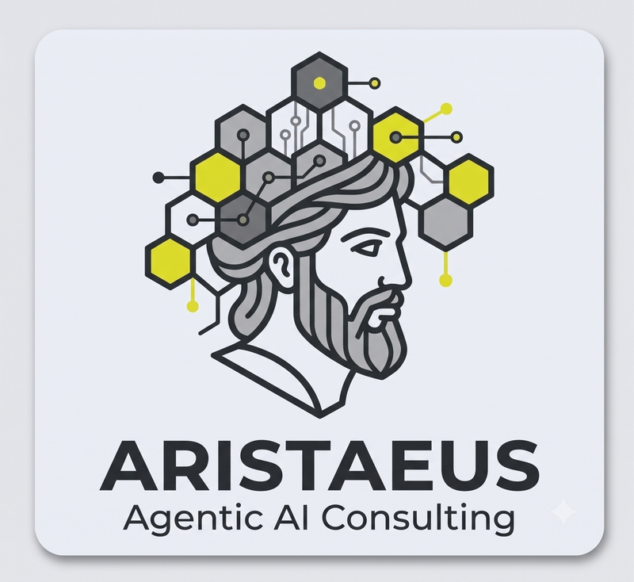

<p align="center">
  
</p>

# Aristaeus Program Intelligence

**Proprietary Hosted MCP Server — Operated by Aristaeus Agentic AI Consulting**

> Historical trending, peer benchmarking, and board-ready executive reports — delivered conversationally through any MCP-compatible AI client.

## What it does

Aristaeus Program Intelligence is a hosted MCP server that gives your AI assistant persistent memory of your security program's maturity journey. While the upstream agents and the Maturity Advisor produce point-in-time analysis, Program Intelligence stores every run, tracks progress, benchmarks against peers, and generates executive materials on demand.

- **Historical Trending** — stores every maturity assessment and tracks score progression by control family, surfacing acceleration, stalls, and regressions with root-cause attribution
- **Peer Benchmarking** — compares your scores against anonymized cohort data from organizations of similar size, industry, and regulatory profile
- **Executive Report Generation** — produces board-ready PDF briefings, quarterly business reviews, and investment justification packages with a single conversational request
- **Conversational Access** — ask questions in plain language ("how has our Detect score changed since we deployed the SIEM?", "where do we rank vs. financial services peers on access control?") and get answers grounded in your historical data
- **Scheduled Delivery** — configure automated weekly/monthly/quarterly reports delivered to stakeholders without manual intervention

## MCP Tools Exposed

| Tool | Description |
|------|-------------|
| `maturity_trend` | Retrieve maturity score history for any framework, function, or control over a date range |
| `peer_benchmark` | Compare current scores against anonymized peer cohort with configurable filters |
| `generate_board_report` | Produce a board-ready executive summary PDF for a specified period |
| `generate_qbr` | Generate a quarterly business review package with trend analysis and recommendations |
| `investment_case` | Build a data-backed investment justification for a specific security initiative |
| `ask_program` | Natural-language query against your program's historical maturity data |
| `schedule_report` | Configure automated report generation and delivery |
| `export_data` | Export raw assessment data for integration with GRC platforms |

## How it works

Program Intelligence operates as a hosted MCP server that your Claude Code session (or any compatible client) connects to via SSE transport. Authentication uses organization-scoped API keys issued during onboarding.

The server maintains a persistent data store of:
- Every Maturity Advisor assessment result (ingested automatically after each pipeline run)
- Derived metrics: velocity, trend lines, control-family correlations
- Anonymized peer cohort statistics (refreshed monthly from participating organizations)
- Generated artifacts: reports, presentations, data exports

When you ask a question or request a report, the server queries your historical data, applies the relevant analytical model, and returns structured results that your AI assistant renders in context — or generates a PDF artifact you can download and forward directly.

## Sample Interactions

```
You: How has our overall maturity changed this quarter?

Program Intelligence: Your overall NIST CSF maturity score increased from
54/100 to 58/100 this quarter (+4 points). Breakdown by function:

  DETECT saw the largest gain (+8) driven by the SIEM deployment in April
  that closed 6 previously-unmonitored ATT&CK techniques.

  RECOVER declined (-2) after the DR test failure on May 12 revealed
  untested recovery procedures for 3 critical asset groups.

  PROTECT, IDENTIFY, and RESPOND showed steady improvement (+2 to +4)
  correlated with the remediation velocity increase from the /fix-today
  automation.

Shall I generate the quarterly trend chart or compare against peers?
```

```
You: Build me an investment case for hiring two detection engineers.

Program Intelligence: [Generates PDF]

  Investment Case: Detection Engineering — 2 FTEs
  
  Current state: DETECT score 78/100, but 12 ATT&CK initial-access
  techniques have zero detection coverage. These techniques appear in
  3 of your top-5 prioritized attack paths.

  Projected impact: Based on peer organizations that added detection
  engineering capacity, estimated +9 to +14 points on DETECT within
  6 months, closing the gap to your target profile (85/100).

  Cost justification: The unmonitored techniques correlate with
  $2.4M in potential breach exposure (based on asset criticality
  scores of affected hosts). Two FTEs at market rate represent
  ~8% of that exposure.
```

## Connection Configuration

Add to your Claude Code MCP settings:

```json
{
  "mcpServers": {
    "aristaeus-program-intelligence": {
      "type": "sse",
      "url": "https://api.aristaeus.ai/mcp/v1",
      "headers": {
        "Authorization": "Bearer ${ARISTAEUS_API_KEY}"
      }
    }
  }
}
```

## Pricing

| Plan | Includes | Price |
|------|----------|-------|
| **Team** | 1 organization, 12-month history, monthly reports, peer benchmarking | $2,500/mo |
| **Business** | Multi-BU, unlimited history, weekly reports, custom frameworks, GRC export | $6,000/mo |
| **Enterprise** | Dedicated instance, custom cohorts, API access, on-prem option, SLA | Custom |

All plans include the Aristaeus Maturity Advisor skill license.

## Platform Compatibility

| Client | Transport | Status |
|--------|-----------|--------|
| Claude Code | SSE | Supported |
| Claude Desktop | SSE | Supported |
| Cursor | SSE | Supported |
| Windsurf | SSE | Supported |
| VS Code Copilot | SSE | Supported |
| Custom MCP clients | SSE | Supported |

## Request Access

Contact Aristaeus Agentic AI Consulting to schedule a demo:

- **Web:** [example/program-intelligence](#)
- **Email:** partners@example
- **Schedule a demo:** [example/demo](#)

---

*Aristaeus Program Intelligence is a proprietary hosted service operated by Aristaeus Agentic AI Consulting. Your data is encrypted at rest and in transit, isolated per-organization, and never shared with peer cohorts in identifiable form.*
